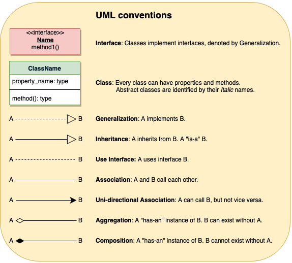
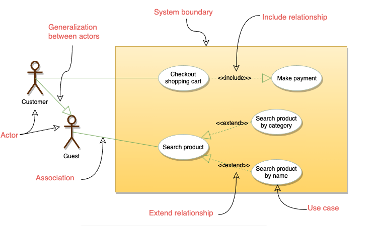
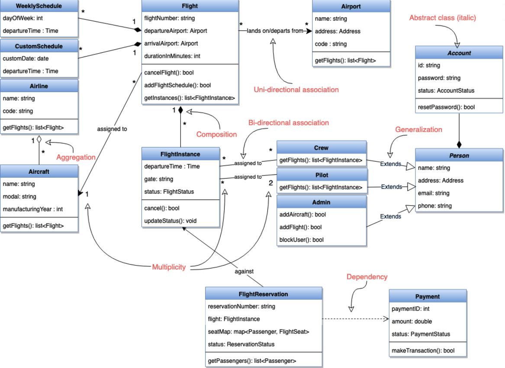
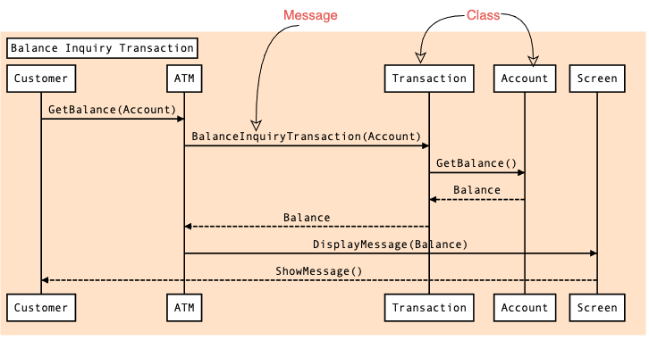
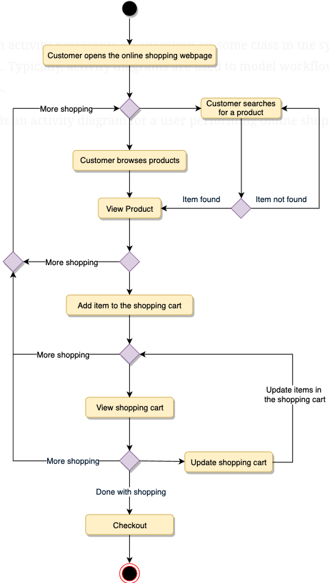

-----------------Everything about objects---------------------

In OOP, there are six concepts to master such as:

    - Class
    - Object
    - Polymorphism
    - Inheritence
    - Abstraction
    - Encapsulation

- UML (Unified Modeling Language) is the one used to descript object in
  the real world. - It helps us develop a quick understanding of a software system. - UML modeling helps in breaking a complex system into discrete pieces that can be easily understood. - UML’s graphical notations can be used to communicate design decisions. - Since UML is independent of any specific platform or language or technology, it is easier to abstract out concepts. - It becomes easier to hand the system over to a new team.

Structural diagrams and Behavioral or interaction diagrams

        Structural UML diagrams

            Class diagram
            Object diagram
            Package diagram
            Component diagram
            Composite structure diagram
            Deployment diagram
            Profile diagram
            Behavioral UML diagrams

            Use case diagram
            Activity diagram
            Sequence diagram
            State diagram
            Communication diagram
            Interaction overview diagram
            Timing diagram

            Use CaseDiagram: Used to describe a set of user scenarios, this diagram, illustrates the functionality provided by the
            system.

            Class Diagram: Used to describe structure and behavior in the use cases, this diagram provides a conceptual model of
            the system in terms of entities and their relationships.

            Activity Diagram: Used to model the functional flow-of-control between two or more class objects.

            Sequence Diagram: Used to describe interactions among classes in terms of an exchange of messages over time.

-----------------------------UML Conventions--------------------------------

UML CONVENTION ( A set of rule we use to describe the flow)

USE CASE DIAGRAM

    Use case diagrams describe a set of actions (called use cases) that a system should or can perform in collaboration
    with one or more external users of the system (called actors). Each use case should provide some observable and
    valuable result to the actors.

    Use Case Diagrams describe the high-level functional behavior of the system.
    It answers what system does from the user point of view.
    Use case answers ‘What will the system do?’ and at the same time tells us ‘What will the system NOT do?’.

CLASS DIAGRAM

    Class diagram is the backbone of object-oriented modeling - it shows how different entities (people, things,
    and data) relate to each other. In other words, it shows the static structures of the system.

SEQUENCE DIAGRAM

    Sequence diagrams describe interactions among classes in terms of an exchange of messages over time and are used to
    explore the logic of complex operations, functions or procedures. In this diagram, the sequence of interactions between
    the objects is represented in a step-by-step manner.

    Sequence diagrams show a detailed flow for a specific use case or even just part of a particular use case. They are
    almost self-explanatory; they show the calls between the different objects in their sequence and can explain, at a
    detailed level, different calls to various objects.

    A sequence diagram has two dimensions: The vertical dimension shows the sequence of messages in the chronological order
    that they occur; the horizontal dimension shows the object instances to which the messages are sent.

Activity Diagrams

    We use Activity Diagrams to illustrate the flow of control in a system. An activity diagram shows the flow of control
    for a system functionality; it emphasizes the condition of flow and the sequence in which it happens. We can also use
    an activity diagram to refer to the steps involved in the execution of a use case.

    Activity diagrams illustrate the dynamic nature of a system by modeling the flow of control from activity to activity.
    An activity represents an operation on some class in the system that results in a change in the state of the system.
    Typically, activity diagrams are used to model workflow or business processes and internal operations.

    Following is an activity diagram for a user performing online shopping:

NB: Final thought. There is no one way of designing something but there is always a better way of approching things when you really understanding what tyou whant to build
Always start with:

       --- System Requirements
       --- Use case diagram (all classes and interaction between them)
       --- Class Diagram (clarifying all your concret classes members)
       --- Design approach of the system
       --- Activity diagrams
       --- implementation
